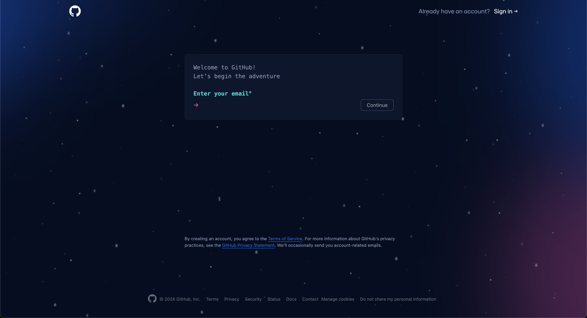
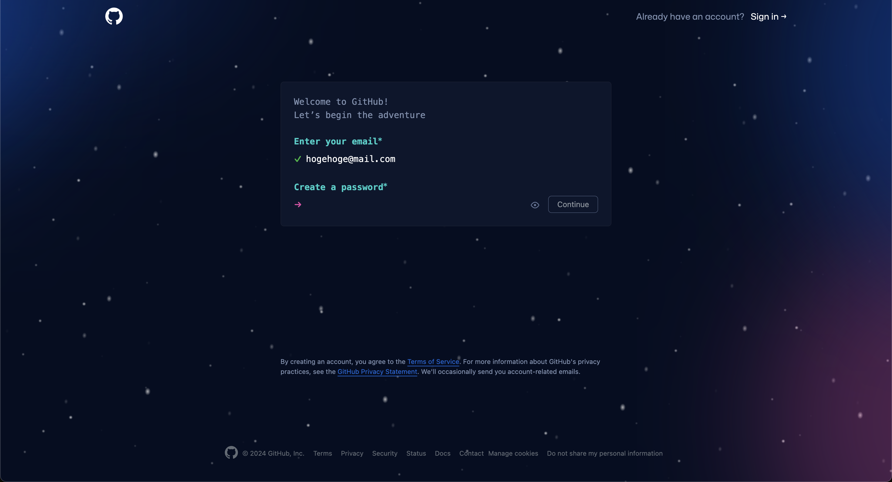
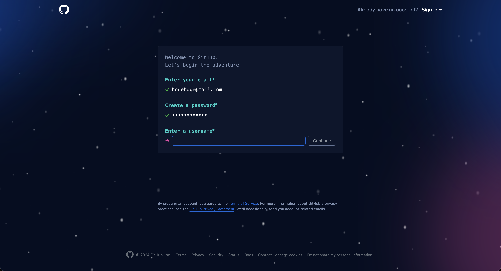
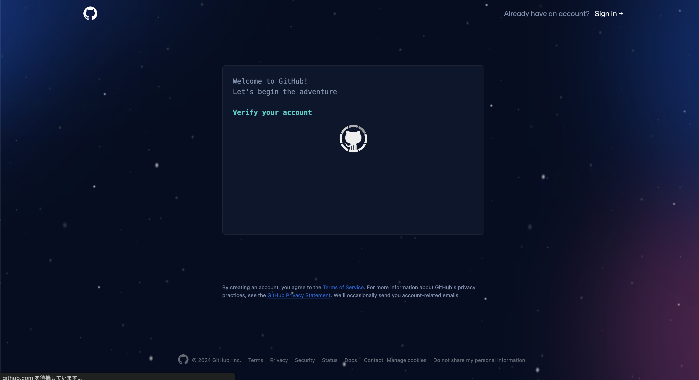

# Step 1: アカウント作成

## 概要
GitHubアカウントを作成することで、リモートリポジトリを作成し、プロジェクトを共有できるようになります。

## GitHubアカウントの作成

1. [GitHubのウェブサイト](https://github.com)にアクセスします。

2. 右上の「Sign up」ボタンをクリックします。

3. ユーザー名、メールアドレス、パスワードを入力して「Create account」ボタンをクリックします。

ユーザー名は他のユーザーと重複しないようにしてください。ユーザー名は後から変更するとめんどくさいことになるので、慎重に選んでください。

4. 指示に従ってアカウントを設定します。

これでGitHubのアカウントが作成できました。次に、Gitのインストールに進みます。

[次のステップへ](./step2.md)