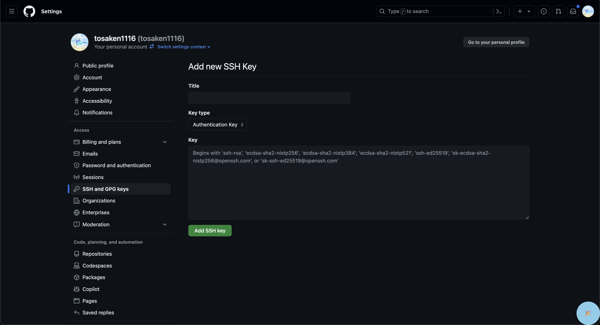

# Step 2: Gitのインストールと初期設定

## 概要
Gitをインストールし、初期設定を行うことで、ローカル環境でGitを使用できるようになります。

## Gitのインストール
- macOS
=> デフォルトで入っているため、インストールの必要はありません。
- Windows
=> wslのインストールが必要です。[次のステップへ](./step2-windows.md)
## Gitの初期設定

1. ターミナル（またはコマンドプロンプト）を開きます。
2. 次のコマンドを実行して、Gitのユーザー名とメールアドレスを設定します。

```bash
git config --global user.name "Your Name"
git config --global user.email "your-email@example.com"
```

## GithubへのSSH接続
この章はやってもやらなくても最低限は問題ありませんが、SSH接続を行うことで、色々な便利な機能を使うことができるようになります。

1. ターミナル（またはコマンドプロンプト）を開きます。
2. 次のコマンドを実行して、SSHキーを生成します。

```bash
cd ~/.ssh && ssh-keygen -t rsa -f "github" -N ""
```

3. 生成されたSSHキーをGitHubに登録します。
次のコマンドを実行して、SSHキーの公開鍵を表示します。

```bash
cat github.pub
```

表示されたものをコピーしておきます

4. GitHubの設定ページにアクセスします

[GitHubの設定ページ](https://github.com/settings/keys)

5. 「New SSH key」ボタンをクリックします。


6. Titleに任意の名前を入力し、Keyに先ほどコピーした公開鍵を貼り付けます。



7. SSHの設定を行います。次のコマンドを実行して、~/.ssh/configファイルを作成します。

```bash
touch ~/.ssh/config
```

8. ~/.ssh/configファイルに次の内容を追加します。

```bash
vim ~/.ssh/config
```
次の内容をコピーして貼り付けます。
```
Host github.com
  HostName github.com
  User git
  IdentityFile ~/.ssh/github
```

`Esc`キーを押して、`:wq`と入力して、`Enter`キーを押して保存して終了します。

9. SSH接続のテストを行います。次のコマンドを実行して、GitHubにSSH接続します。

```bash
ssh -T git@github.com
```

実行結果
```
Hi username! You've successfully authenticated, but GitHub does not provide shell access.
```

これでSSH接続の設定が完了しました。

[次のステップへ](./step3.md)