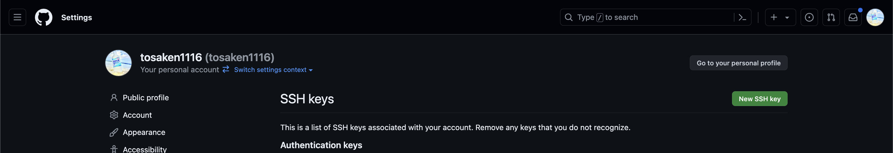

# Step 2: Gitのインストールと初期設定

## 概要
Gitをインストールし、初期設定を行うことで、ローカル環境でGitを使用できるようになります。

## Gitのインストール
- macOS
=> デフォルトで入っているため、インストールの必要はありません。
- Windows
=> wslのインストールが必要です。[次のステップへ](./step2-windows.md)
## Gitの初期設定

1. ターミナル（またはコマンドプロンプト）を開きます。
2. 次のコマンドを実行して、Gitのユーザー名とメールアドレスを設定します。

```bash
git config --global user.name "Your Name"
git config --global user.email "your-email@example.com"
```

## GithubへのSSH接続
この章はやってもやらなくても最低限は問題ありませんが、SSH接続を行うことで、色々な便利な機能を使うことができるようになります。

1. ターミナル（またはコマンドプロンプト）を開きます。
2. 次のコマンドを実行して、SSHキーを生成します。

```bash
cd ~/.ssh && ssh-keygen -t rsa -f "github" -N ""
```

3. 生成されたSSHキーをGitHubに登録します。
次のコマンドを実行して、SSHキーの公開鍵を表示します。

```bash
cat github.pub
```

表示されたものをコピーしておきます

4. GitHubの設定ページにアクセスします

[GitHubの設定ページ](https://github.com/settings/keys)

5. 「New SSH key」ボタンをクリックします。



6. Titleに任意の名前を入力し、Keyに先ほどコピーした公開鍵を貼り付けます。


これでSSHキーの登録が完了しました。次に、GitHubにリモートリポジトリを作成し、ローカルリポジトリと連携させます。

[次のステップへ](./step3.md)