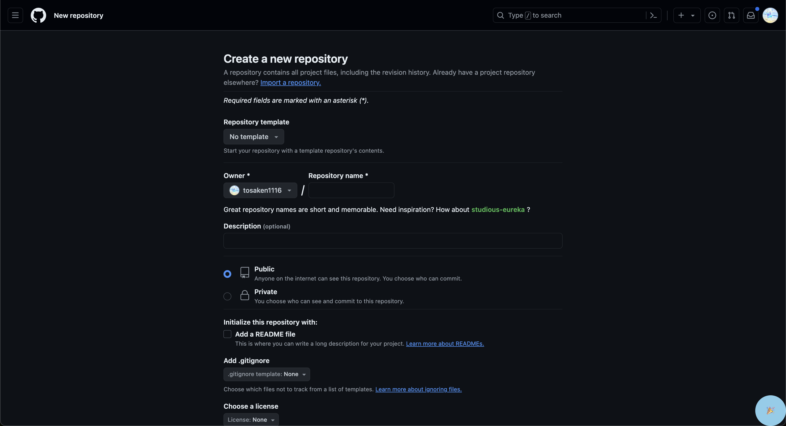
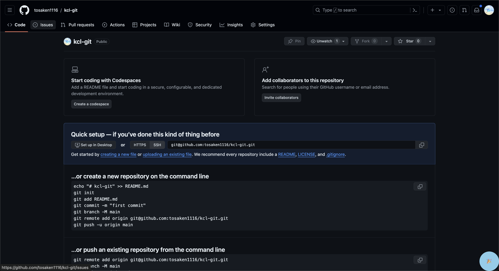
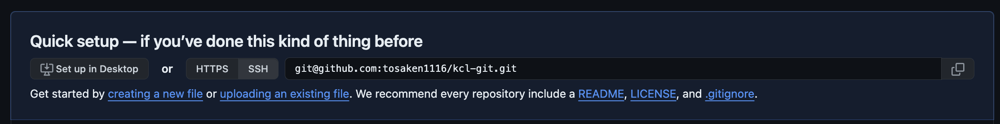
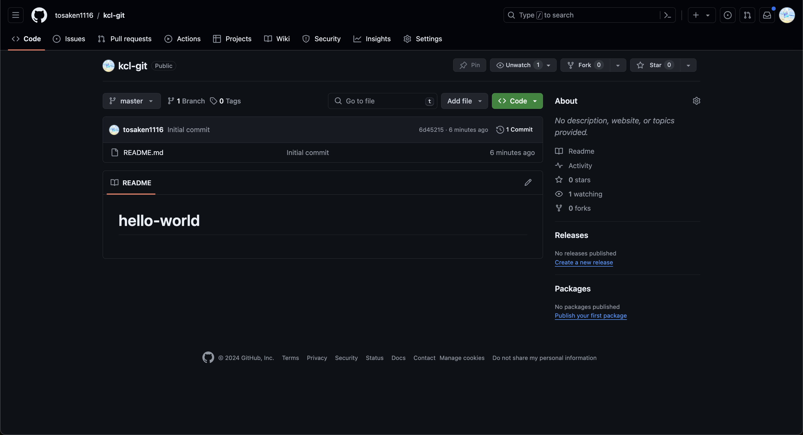

#　リポジトリの作成

## ローカルリポジトリの初期化
リポジトリを初期化するために、`git init`コマンドを実行します。このコマンドは、リポジトリのルートディレクトリに`.git`ディレクトリを作成します。このディレクトリには、リポジトリの設定や履歴などが保存されます。

```bash
cd ~ && mkdir -p github/hello-world
```

```bash
cd ~/github/hello-world
```

```bash
git init
```

```
Initialized empty Git repository in /Users/hogehoge/github/hello-world/.git/

```


## ファイルの作成
リポジトリにファイルを追加するために、`touch`コマンドを使用します。`touch`コマンドは、ファイルのタイムスタンプを更新するためのコマンドです。ファイルが存在しない場合は、新しいファイルを作成します。

```bash
touch README.md
```

```bash
echo "# hello-world" >> README.md
```

```bash
cat README.md
```

```
# hello-world
```

## コミットをを行う

リポジトリにファイルを追加した後、`git add`コマンドを使用して、ファイルをステージングエリアに追加します。次に、`git commit`コマンドを使用して、ステージングエリアの変更をコミットします。

ステージングエリアとは、変更を一時的に保存する場所のことです。ステージングエリアに変更を追加することで、変更をまとめてコミットすることができます。

```bash
git add README.md
```

```bash
git commit -m "Initial commit"
```

コミットとは、リポジトリの履歴に変更を記録することです。コミットメッセージには、変更の内容や目的を簡潔に記述することが推奨されています。

```
[main (root-commit) 6d45215] Initial commit
 1 file changed, 1 insertion(+)
 create mode 100644 README.md
```


## リモートリポジトリの作成
再びGitHubのウェブサイトにアクセスし、リモートリポジトリを作成します。リモートリポジトリは、リモートサーバー上に保存されるリポジトリのことです。リモートリポジトリを作成することで、ローカルリポジトリとリモートリポジトリを連携させることができます。

1. GitHubのウェブサイトにアクセスします。
[GitHubのウェブサイト](https://github.com/new)

2. リポジトリ名を入力し、`Create repository`ボタンをクリックします。



3. 結果

次のような画面が表示されれば、リモートリポジトリの作成が完了です。




## リモートリポジトリの登録

リモートリポジトリを登録するために、`git remote add`コマンドを使用します。このコマンドは、リモートリポジトリのURLを登録します。リモートリポジトリのURLは、リモートリポジトリのアドレスを指定します。

ここの青枠の中の`git@`から始まるURLをコピーしてください。


次のコマンドを実行して、リモートリポジトリを登録します。

```bash
git remote add origin [コピーしたurl]

```


## プッシュを行う

リモートリポジトリにローカルリポジトリの変更を反映するために、`git push`コマンドを使用します。このコマンドは、ローカルリポジトリの変更をリモートリポジトリにアップロードします。

```bash
git push origin main
```


## 結果

次のような画面が表示されれば、リモートリポジトリにローカルリポジトリの変更が反映されました。

```
Enumerating objects: 3, done.
Counting objects: 100% (3/3), done.
Writing objects: 100% (3/3), 227 bytes | 227.00 KiB/s, done.
Total 3 (delta 0), reused 0 (delta 0), pack-reused 0 (from 0)
To github.com:tosaken1116/kcl-git.git
 * [new branch]      main -> main

```



これで基本的なリポジトリの作成とプッシュが完了しました。次に、ブランチの作成と切り替えについて学習します。

[次のステップへ](./step4.md)