# プルリクエスト

プルリクエストを作成するには、GitHubのWebサイト上で行います。

が, まずはプルリクエストを作成するための準備を行います。

## ブランチの切り替え
前章で作成した`feature`ブランチに切り替えます。

```bash
git switch feature
```

実行結果
```
Switched to branch 'feature'
```

## ファイルの編集
次に、`README.md`ファイルを編集します。

```bash
echo "1. Edit from feature branch" >> README.md
```

```bash
cat README.md
```

```
# hello-world
1. Edit from feature branch
```

## コミットを行う
ステップ3と同様に、ファイルの変更をコミットします。

```bash
git add README.md
```

```bash
git commit -m "Edit from feature branch"
```

実行結果

```
[feature c90d03f] Edit from feature branch
 1 file changed, 1 insertion(+)
```

次に、リモートリポジトリに変更をプッシュします。

```bash
git push origin feature
```

実行結果
```
Enumerating objects: 5, done.
Counting objects: 100% (5/5), done.
Writing objects: 100% (3/3), 297 bytes | 297.00 KiB/s, done.
Total 3 (delta 0), reused 0 (delta 0), pack-reused 0 (from 0)
remote:
remote: Create a pull request for 'feature' on GitHub by visiting:
remote:      https://github.com/tosaken1116/kcl-git/pull/new/feature
remote:
To github.com:tosaken1116/kcl-git.git
 * [new branch]      feature -> feature
```

ここでリモートリポジトリのページを見てみましょう

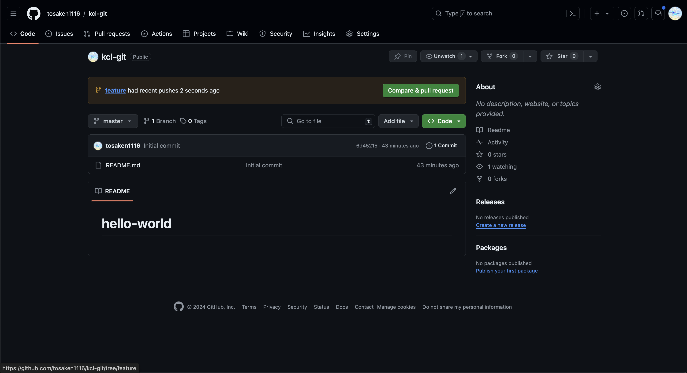

`README.md`ファイルを変更しましたがページのREADMEには反映されていません。(hello-worldのまま)

これは、`feature`ブランチに変更をプッシュしただけで、`main`ブランチには変更が反映されていないためです。

試しに`feature`ブランチのページを見てみましょう

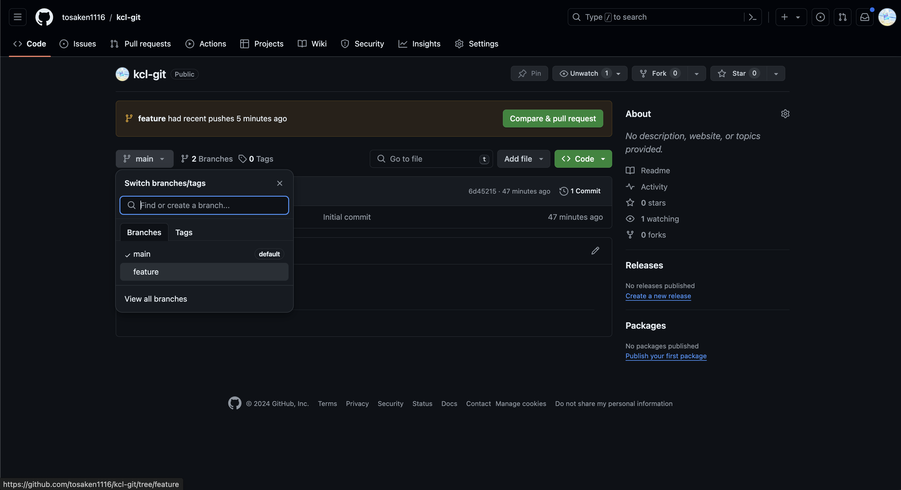

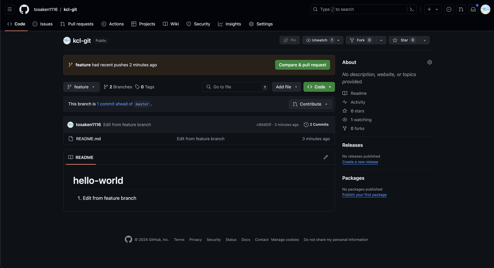

`README.md`ファイルが変更されていることが確認できます。(`1. Edit from feature branch`が追加されている)


## プルリクエストの作成
プルリクエストを作成するには、GitHubのWebサイト上で行います。

[pull requestの作成](https://github.com/tosaken1116/kcl-git/pulls)

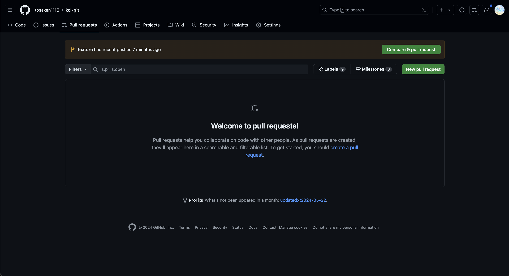

`New pull request`ボタンをクリックします。


`base`に`main`ブランチ、`compare`に`feature`ブランチを選択します。

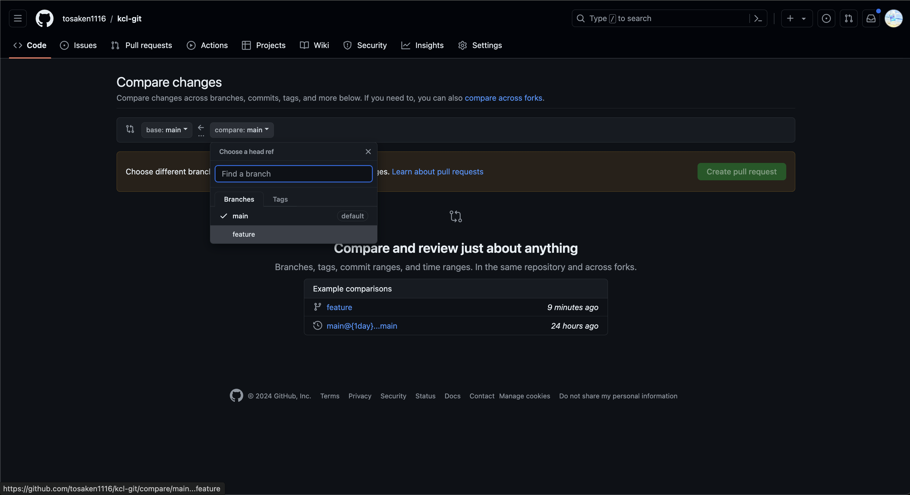

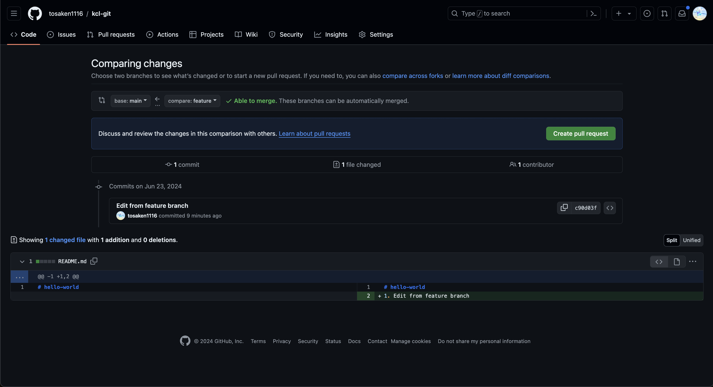

画面の下の方にどのような変更があったかが表示されます。

`Create pull request`ボタンをクリックします。

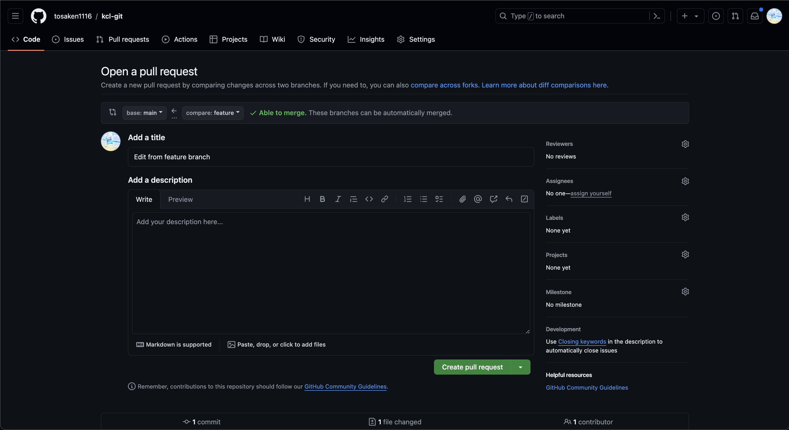

まずはプルリクエストのタイトルと説明を入力します。

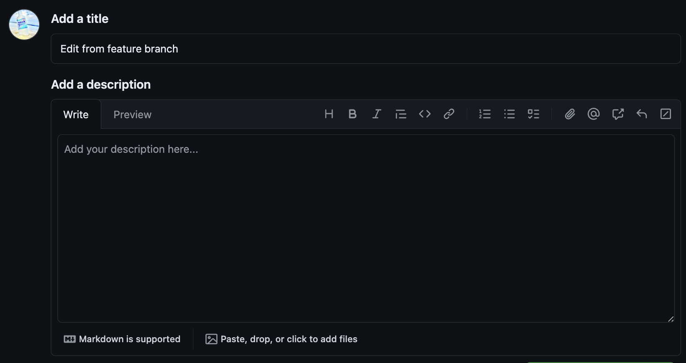

タイトルはそのブランチで何をしたかがわかるように簡潔に記述します。

説明はその変更がなぜ必要か、どのような変更を行ったかを記述します。

今回は適当でいいです

Assignersを設定しておきましょう

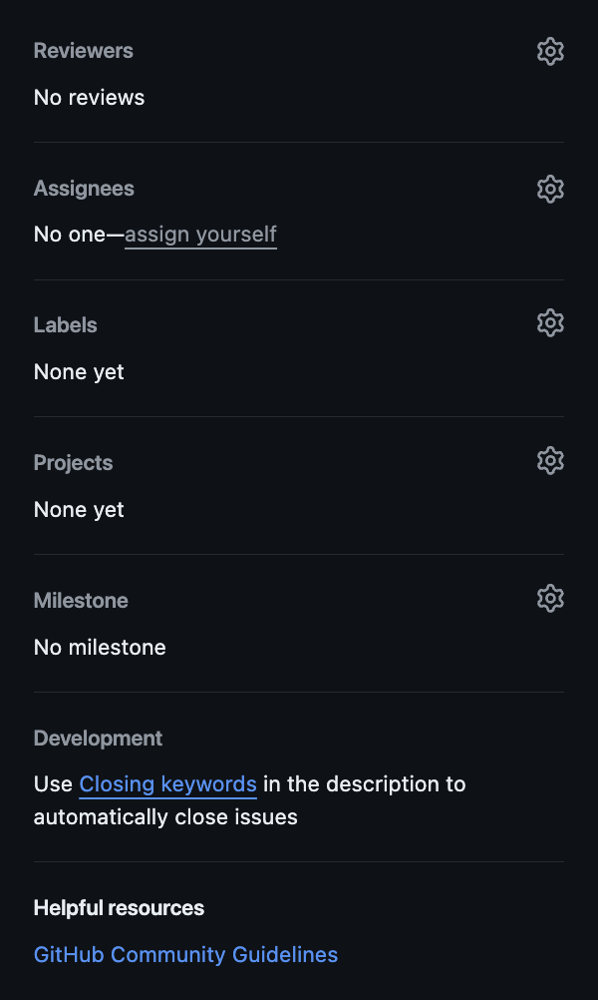

自分のアカウントを選びます

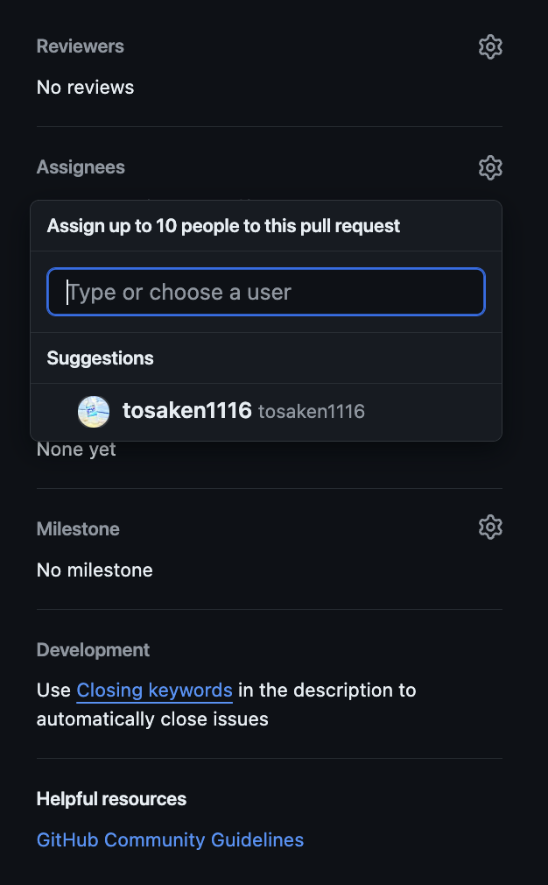


最後に`Create pull request`ボタンをクリックします。


次のような画面が表示されれば、プルリクエストの作成が完了です。

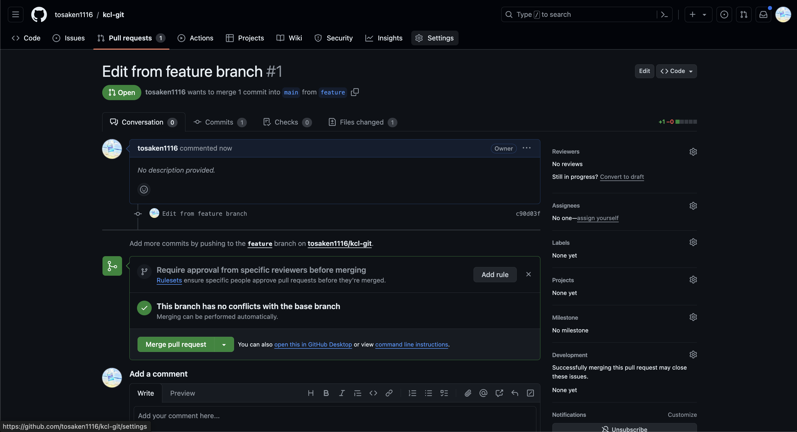

プルリクエストが作成されると、他のメンバーが変更内容を確認し、コメントを残すことができます。

が、今回はプロジェクトに参加しているメンバーがいないので、自分でマージしてみましょう。

`Merge pull request`ボタンをクリックします。

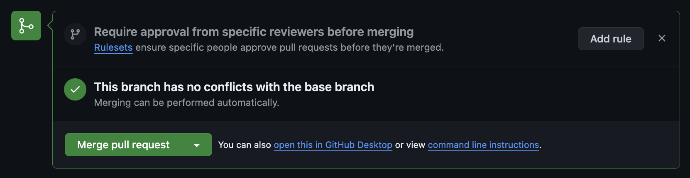

`Confirm merge`ボタンをクリックします。

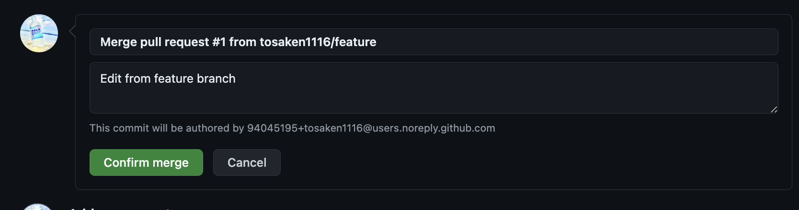


これでプルリクエストがマージされました。

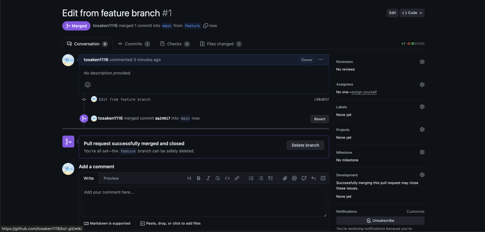

`main`ブランチに変更が反映されていることが確認できます。

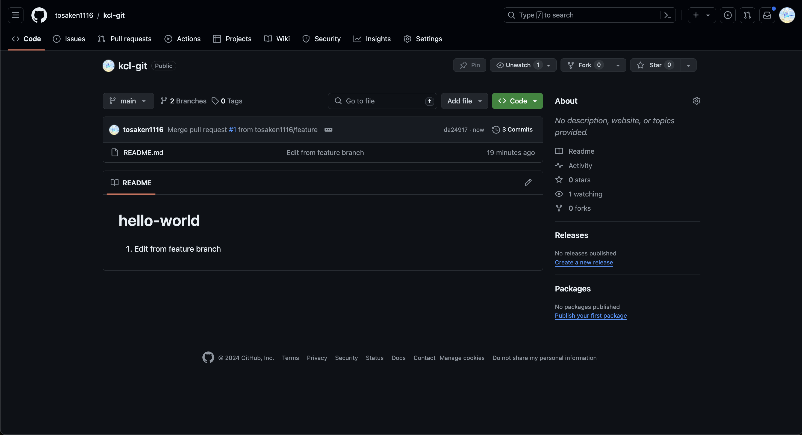

これでプルリクエストの作成とマージが完了しました。

次のステップへ進みましょう。
