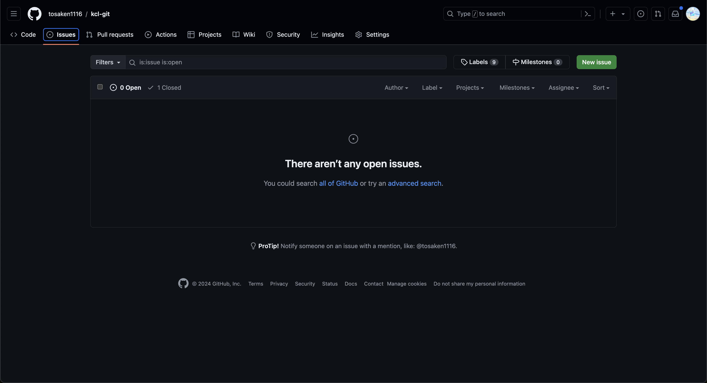

# issue

githubにはissueという機能があります

issueとは、プロジェクトのタスクやバグを管理するための機能です。issueを使うことで、プロジェクトの進捗状況を把握しやすくなります。

## issueの作成

issueを作成するには、GitHubのWebサイト上で行います。

`issues`をクリックします。


`New issue`ボタンをクリックします。


タイトルと本文を入力します。

ここでは例として、テキストファイルの追加を行うissueを作成します。

`Submit new issue`ボタンをクリックします。


issueが作成されました。


自分をアサインしておきましょう。

`Assign yourself`をクリックします。


これでissueの作成が完了しました。

プロジェクト開発は基本的に次のような流れで進められます。

1. issueの作成
2. ブランチの作成
3. コードの変更
4. プルリクエストの作成
5. レビュー
6. マージ


ではこのタスクを実際にやってみましょう

## issueに基づいたタスクを実行する

issueに基づいたタスクを実行するために、issueを参照してブランチを作成し、コードを変更します。

ローカルのターミナルで次のコマンドを実行します。

```bash
git switch main
```

```bash
git switch -c feat/add-text-file-#2
```

実行結果

```
Switched to a new branch 'feat/add-text-file-#2'
```

今回ブランチには`feat/add-text-file-#2`という名前をつけました。

ブランチの命名規則はプロジェクトによって異なりますが今回は次のような規則でつけています

```
[タスクの種類]/[タスクの内容]-#[issue番号]
```

タスクの種類は`feat`(feature)や`fix`(bug fix)などがあります。

タスクの内容はissueのタイトルを参考に簡潔につけましょう

issue番号はissueの番号です。


次に、テキストファイルを作成します。

```bash
echo "Hello, World!" > text.txt
```

```bash
cat text.txt
```

`実行結果`
```
Hello, World!
```

次に、コミットを行います。

```bash
git add text.txt
```

```bash
git commit -m "Add text.txt"
```

`実行結果`
```
[feat/add-text-file-#2 4a41866] Add text.txt
 1 file changed, 1 insertion(+)
 create mode 100644 text.txt
```

ここで`README.md`をみてみましょう

```bash
cat README.md
```

`実行結果`
```
# hello-world
```

`1. Edit from feature branch`が追加されていません


これはリモートでマージした変更差分がローカルに反映されていないためです


一旦mainブランチに戻ります

```bash
git switch main
```

`実行結果`
```
Switched to branch 'main'
Your branch is behind 'origin/main' by 2 commits, and can be fast-forwarded.
  (use "git pull" to update your local branch)
```

`main`ブランチは`origin/main`より2つのコミットが遅れていると表示されています

`origin/main`はリモートリポジトリの`main`ブランチを指しています

`git pull`コマンドを実行することで、リモートリポジトリの変更をローカルリポジトリに取り込むことができます

```bash
git pull
```

`実行結果`
```
Updating 6d45215..da24917
Fast-forward
 README.md | 1 +
 1 file changed, 1 insertion(+)
```

`README.md`が更新されました

```bash
cat README.md
```

`実行結果`
```
# hello-world
1. Edit from feature branch
```

`1. Edit from feature branch`が追加されています

次に、`feat/add-text-file-#2`ブランチに戻ります

```bash
git switch feat/add-text-file-#2
```

`実行結果`
```
Switched to branch 'feat/add-text-file-#2'
```

`main`ブランチから`feat/add-text-file-#2`ブランチに切り替わりました

ここで`README.md`をみてみましょう

```bash
cat README.md
```

`実行結果`
```
# hello-world
```

おや？`1. Edit from feature branch`が表示されていません

これは`feat/add-text-file-#2`ブランチを作成した時の親ブランチであるmainがリモートリポジトリと同期する前の状態を指しているためです

`main`ブランチに`feat/add-text-file-#2`ブランチの変更を取り込むために、mainブランチにマージします

```bash
git merge main
```

`実行結果`
```
Merge branch 'main' into feat/add-text-file-#2
# Please enter a commit message to explain why this merge is necessary,
# especially if it merges an updated upstream into a topic branch.
#
# Lines starting with '#' will be ignored, and an empty message aborts
# the commit.
~
```

マージコミットメッセージが表示されます

ここではそのまま保存して終了します

`Esc`キーを押して、`:wq`を入力して`Enter`キーを押します

`実行結果`
```
Merge made by the 'ort' strategy.
 README.md | 1 +
 1 file changed, 1 insertion(+)
```

`README.md`が更新されました

```bash
cat README.md
```

`実行結果`
```
# hello-world
1. Edit from feature branch
```

`1. Edit from feature branch`が表示されています

次に、`feat/add-text-file-#2`ブランチに変更をプッシュします

```bash
git push origin feat/add-text-file-#2
```

`実行結果`
```
Enumerating objects: 7, done.
Counting objects: 100% (7/7), done.
Delta compression using up to 8 threads
Compressing objects: 100% (4/4), done.
Writing objects: 100% (5/5), 580 bytes | 580.00 KiB/s, done.
Total 5 (delta 0), reused 0 (delta 0), pack-reused 0 (from 0)
remote:
remote: Create a pull request for 'feat/add-text-file-#2' on GitHub by visiting:
remote:      https://github.com/tosaken1116/kcl-git/pull/new/feat/add-text-file-%232
remote:
To github.com:tosaken1116/kcl-git.git
 * [new branch]      feat/add-text-file-#2 -> feat/add-text-file-#2
```

プッシュが完了しました

次に、プルリクエストを作成します

これはstep5を参考に作ってください

プルリクエストのメッセージの部分に`close #2`と入力してください


これでissueに基づいたタスクを完了しました

プルリクエストをマージした後issue一覧を見てみましょう



issueがクローズされていることが確認できます

プルリクエストのメッセージに`close #2`と入力することで、プルリクエストがマージされた時にissueの2番がクローズされるようになります


これで基本的なgit githubの使い方がわかりました

お疲れ様でした

